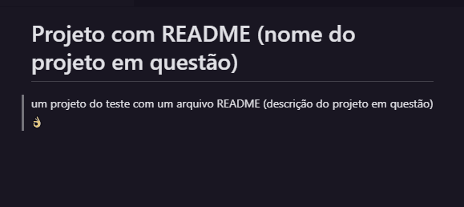

# Projeto com README (nome do projeto em questão)
um projeto do teste com um arquivo README (descrição do projeto em questão)👌

[]

## Tecnoligias utilizadas 
- HTML
- CSS
- JS

## Como utilizar

1 - Passo a passo de como usar o seu projeto

```
git clone <url>

```
2 - Passo a passo de como usar o seu projeto

```
cd repositorio com readme

```

## Coisas que eu prendi

## Dificuldades